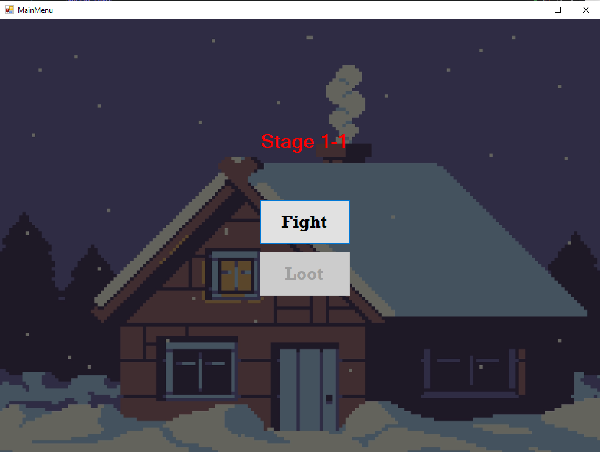
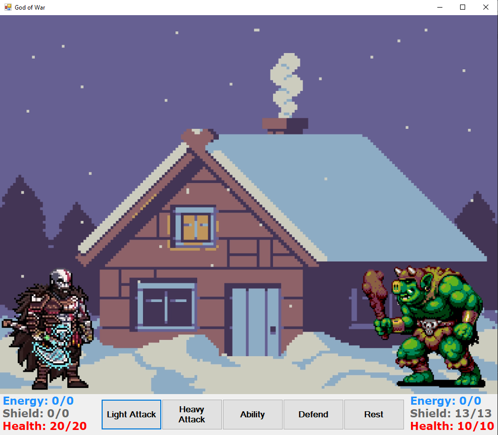
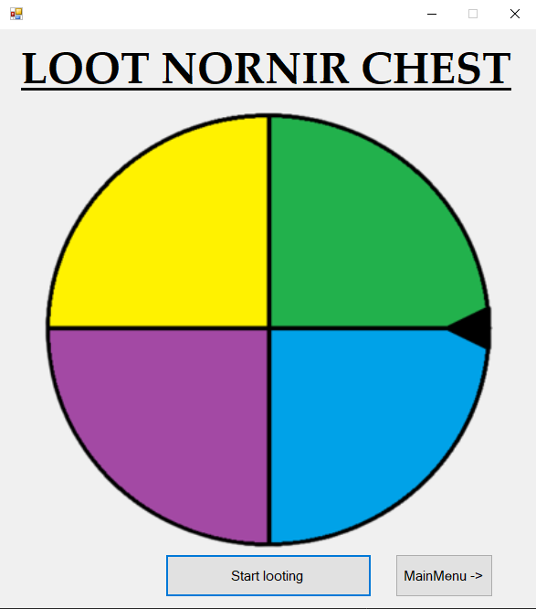
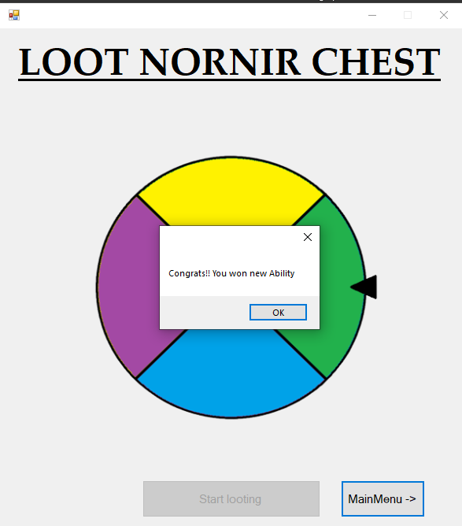

# Turn-based-strategy-game
This paper will talk about a new turn-based strategic combat game that combines elements of strategy, combat and looting. The game offers a unique experience where players will have to progress through different stages and difficulty levels, while collecting items and upgrading their character's abilities. 

#Main menu

When the game starts, we see that we have a stage on the screen. The first number is also the tier 1 enemy we face, while the second number is the stage number and it goes up to 3 for tier 1, up to 2 for tier 2, and tier 3 is the ultimate enemy of the game, and after defeating that, the game is over. The loot button is disabled until the player wins the fight and can only spin the wheel once per win.

#Battle screen

This is the screen where the main action takes place. Both the player and the enemy have visible stats like Energy, Shield and Health. Energy is needed to perform the ability and it takes 1-2 energy, while it is obtained by the rest action. The player also has both Shield and Health stats. Shield is a stat that protects players' helts. And after the shield reaches zero, the player begins to lose helts, which when they reach zero lead to defeat. The player can perform both Light and Heavy Attack actions, which are used for a direct attack on the enemy. Heavy attack does more damage but has a lower chance to hit. And finally, the Defend button serves to reduce the damage that the opponent inflicts if he attacks after pressing that button. Each of the actions has either a small animation or text above the head that says what happened.

#Loot

The loot screen looks like this. After each win the player can spin the wheel and if he gets something, it updates it in the database and then there is a change in the next battle

This is what it looks like after the wheel spins. The player gets a glimpse of whether he won something or not, the spin button stops working and the player can then go back to the home menu to continue playing.
